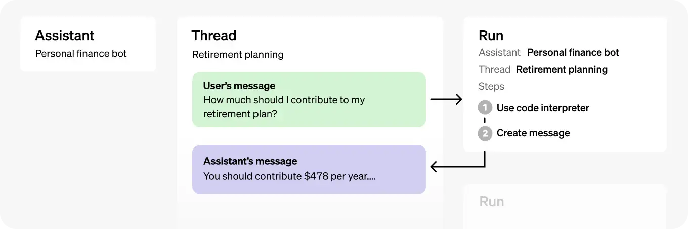

# Assistants API Overview
* https://platform.openai.com/docs/assistants/overview


The Assistants API allows you to build AI assistants within your own applications. An Assistant has instructions and can leverage models, tools, and files to respond to user queries

The Assistants API currently supports three types of [tools](https://platform.openai.com/docs/assistants/tools): 
* Code Interpreter, 
* File Search,
* and Function calling.

# How Assistants work

The Assistants API is in BETA and is designed to help developers build powerful AI assistants capable of performing a variety of tasks.


1. Assistants can call OpenAI’s [models](https://platform.openai.com/docs/models) with specific instructions to tune their personality and capabilities.
2. Assistants can access multiple tools in parallel. These can be both OpenAI-hosted tools — like [code_interpreter](https://platform.openai.com/docs/assistants/tools/code-interpreter) and [file_search](https://platform.openai.com/docs/assistants/tools/file-search) — or tools you build / host (via [function calling](https://platform.openai.com/docs/assistants/tools/function-calling)).
3. Assistants can access **persistent Threads**. Threads simplify AI application development by storing message history and truncating it when the conversation gets too long for the model’s context length. You create a Thread once, and simply append Messages to it as your users reply.
4. Assistants can access files in several formats — either as part of their creation or as part of Threads between Assistants and users. When using tools, Assistants can also create files (e.g., images, spreadsheets, etc) and cite files they reference in the Messages they create.

# Objects




* **Assistant**: Purpose-built AI that uses OpenAI’s [models](https://platform.openai.com/docs/models) and calls [tools](https://platform.openai.com/docs/assistants/tools)
* **Thread**: A conversation session between an Assistant and a user. Threads store Messages and automatically handle truncation to fit content into a model’s context.
* **Message**:	A message created by an Assistant or a user. Messages can include text, images, and other files. Messages stored as a list on the Thread.
* **Run**: An invocation of an Assistant on a Thread. The Assistant uses its configuration and the Thread’s Messages to perform tasks by calling models and tools. As part of a Run, the Assistant appends Messages to the Thread.
* **Run Step**:	A detailed list of steps the Assistant took as part of a Run. An Assistant can call tools or create Messages during its run. Examining Run Steps allows you to introspect how the Assistant is getting to its final results.


# Assistants API Quickstart

A typical integration of the Assistants API has the following flow:

1. Create an [Assistant](https://platform.openai.com/docs/api-reference/assistants/createAssistant) by defining its custom instructions and picking a model. If helpful, add files and enable tools like Code Interpreter, File Search, and Function calling.
2. Create a [Thread](https://platform.openai.com/docs/api-reference/threads) when a user starts a conversation.
3. Add [Messages](https://platform.openai.com/docs/api-reference/messages) to the Thread as the user asks questions.
4. [Run](https://platform.openai.com/docs/api-reference/runs) the Assistant on the Thread to generate a response by calling the model and the tools.

This starter guide walks through the key steps to create and run an Assistant that uses [Code Interpreter](https://platform.openai.com/docs/assistants/tools/code-interpreter). In this example, we're creating an Assistant that is a personal math tutor, with the Code Interpreter tool enabled.

Calls to the Assistants API require that you pass a beta HTTP header. This is handled automatically if you’re using OpenAI’s official Python or Node.js SDKs. `OpenAI-Beta: assistants=v2`

## Step 1: Create an Assistant

An [Assistant](https://platform.openai.com/docs/api-reference/assistants/object) represents an entity that can be configured to respond to a user's messages using several parameters like `model`, `instructions`, and `tools`.

```python
from openai import OpenAI
client = OpenAI()
  
assistant = client.beta.assistants.create(
  name="Math Tutor",
  instructions="You are a personal math tutor. Write and run code to answer math questions.",
  tools=[{"type": "code_interpreter"}],
  model="gpt-4o",
)
```

## Step 2: Create a Thread

A [Thread](https://platform.openai.com/docs/api-reference/threads/object) represents a conversation between a user and one or many Assistants. You can create a Thread when a user (or your AI application) starts a conversation with your Assistant.

```python
thread = client.beta.threads.create()
```

## Step 3: Add a Message to the Thread

The contents of the messages your users or applications create are added as [Message](https://platform.openai.com/docs/api-reference/messages/object) objects to the Thread. Messages can contain both text and files. There is no limit to the number of Messages you can add to Threads — we smartly truncate any context that does not fit into the model's context window.

```python
message = client.beta.threads.messages.create(
  thread_id=thread.id,
  role="user",
  content="I need to solve the equation `3x + 11 = 14`. Can you help me?"
)
```

## Step 4: Create a Run

Once all the user Messages have been added to the Thread, you can [Run](https://platform.openai.com/docs/api-reference/runs/object) the Thread with any Assistant. Creating a Run uses the model and tools associated with the Assistant to generate a response. These responses are added to the Thread as assistant Messages.

You can use the 'create and stream' helpers in the Python and Node SDKs to create a run and stream the response.
```python
from typing_extensions import override
from openai import AssistantEventHandler
 
# First, we create a EventHandler class to define
# how we want to handle the events in the response stream.
 
class EventHandler(AssistantEventHandler):    
  @override
  def on_text_created(self, text) -> None:
    print(f"\nassistant > ", end="", flush=True)
      
  @override
  def on_text_delta(self, delta, snapshot):
    print(delta.value, end="", flush=True)
      
  def on_tool_call_created(self, tool_call):
    print(f"\nassistant > {tool_call.type}\n", flush=True)
  
  def on_tool_call_delta(self, delta, snapshot):
    if delta.type == 'code_interpreter':
      if delta.code_interpreter.input:
        print(delta.code_interpreter.input, end="", flush=True)
      if delta.code_interpreter.outputs:
        print(f"\n\noutput >", flush=True)
        for output in delta.code_interpreter.outputs:
          if output.type == "logs":
            print(f"\n{output.logs}", flush=True)
 
# Then, we use the `stream` SDK helper 
# with the `EventHandler` class to create the Run 
# and stream the response.
 
with client.beta.threads.runs.stream(
  thread_id=thread.id,
  assistant_id=assistant.id,
  instructions="Please address the user as Jane Doe. The user has a premium account.",
  event_handler=EventHandler(),
) as stream:
  stream.until_done()
```