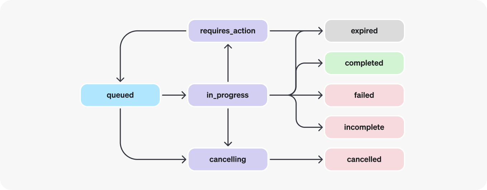
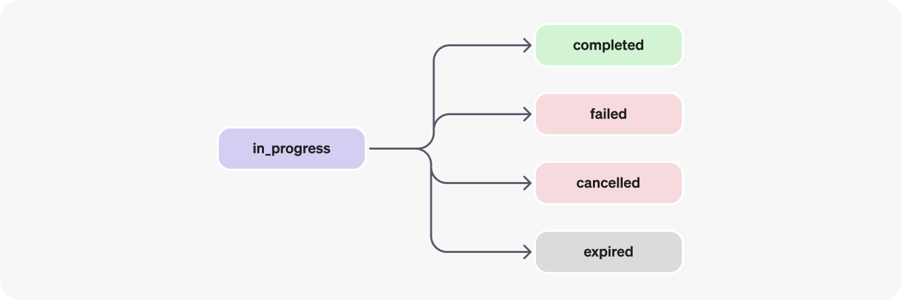

# Assistants API Overview
* https://platform.openai.com/docs/assistants/overview


The Assistants API allows you to build AI assistants within your own applications. An Assistant has instructions and can leverage models, tools, and files to respond to user queries

The Assistants API currently supports three types of [tools](https://platform.openai.com/docs/assistants/tools): 
* Code Interpreter, 
* File Search,
* and Function calling.

You can explore the capabilities of the Assistants API using the [Assistants playground](https://platform.openai.com/playground?mode=assistant) or by building a step-by-step integration outlined in our [Assistants API quickstart](https://platform.openai.com/docs/assistants/quickstart).

# How Assistants work

The Assistants API is in BETA and is designed to help developers build powerful AI assistants capable of performing a variety of tasks.


1. Assistants can call OpenAI’s [models](https://platform.openai.com/docs/models) with specific instructions to tune their personality and capabilities.
2. Assistants can access multiple tools in parallel. These can be both OpenAI-hosted tools — like [code_interpreter](https://platform.openai.com/docs/assistants/tools/code-interpreter) and [file_search](https://platform.openai.com/docs/assistants/tools/file-search) — or tools you build / host (via [function calling](https://platform.openai.com/docs/assistants/tools/function-calling)).
3. Assistants can access **persistent Threads**. Threads simplify AI application development by storing message history and truncating it when the conversation gets too long for the model’s context length. You create a Thread once, and simply append Messages to it as your users reply.
4. Assistants can access files in several formats — either as part of their creation or as part of Threads between Assistants and users. When using tools, Assistants can also create files (e.g., images, spreadsheets, etc) and cite files they reference in the Messages they create.

# Objects


* **Assistant**: Purpose-built AI that uses OpenAI’s [models](https://platform.openai.com/docs/models) and calls [tools](https://platform.openai.com/docs/assistants/tools)
* **Thread**: A conversation session between an Assistant and a user. Threads store Messages and automatically handle truncation to fit content into a model’s context.
* **Message**:	A message created by an Assistant or a user. Messages can include text, images, and other files. Messages stored as a list on the Thread.
* **Run**: An invocation of an Assistant on a Thread. The Assistant uses its configuration and the Thread’s Messages to perform tasks by calling models and tools. As part of a Run, the Assistant appends Messages to the Thread.
* **Run Step**:	A detailed list of steps the Assistant took as part of a Run. An Assistant can call tools or create Messages during its run. Examining Run Steps allows you to introspect how the Assistant is getting to its final results.


# Assistants API Quickstart

A typical integration of the Assistants API has the following flow:

1. Create an [Assistant](https://platform.openai.com/docs/api-reference/assistants/createAssistant) by defining its custom instructions and picking a model. If helpful, add files and enable tools like Code Interpreter, File Search, and Function calling.
2. Create a [Thread](https://platform.openai.com/docs/api-reference/threads) when a user starts a conversation.
3. Add [Messages](https://platform.openai.com/docs/api-reference/messages) to the Thread as the user asks questions.
4. [Run](https://platform.openai.com/docs/api-reference/runs) the Assistant on the Thread to generate a response by calling the model and the tools.

This starter guide walks through the key steps to create and run an Assistant that uses [Code Interpreter](https://platform.openai.com/docs/assistants/tools/code-interpreter). In this example, we're creating an Assistant that is a personal math tutor, with the Code Interpreter tool enabled.

Calls to the Assistants API require that you pass a beta HTTP header. This is handled automatically if you’re using OpenAI’s official Python or Node.js SDKs. `OpenAI-Beta: assistants=v2`

## Step 1: Create an Assistant

An [Assistant](https://platform.openai.com/docs/api-reference/assistants/object) represents an entity that can be configured to respond to a user's messages using several parameters like `model`, `instructions`, and `tools`.

```python
from openai import OpenAI
client = OpenAI()
  
assistant = client.beta.assistants.create(
  name="Math Tutor",
  instructions="You are a personal math tutor. Write and run code to answer math questions.",
  tools=[{"type": "code_interpreter"}],
  model="gpt-4o",
)
```

## Step 2: Create a Thread

A [Thread](https://platform.openai.com/docs/api-reference/threads/object) represents a conversation between a user and one or many Assistants. You can create a Thread when a user (or your AI application) starts a conversation with your Assistant.

```python
thread = client.beta.threads.create()
```

## Step 3: Add a Message to the Thread

The contents of the messages your users or applications create are added as [Message](https://platform.openai.com/docs/api-reference/messages/object) objects to the Thread. Messages can contain both text and files. There is no limit to the number of Messages you can add to Threads — we smartly truncate any context that does not fit into the model's context window.

```python
message = client.beta.threads.messages.create(
  thread_id=thread.id,
  role="user",
  content="I need to solve the equation `3x + 11 = 14`. Can you help me?"
)
```

## Step 4: Create a Run

Once all the user Messages have been added to the Thread, you can [Run](https://platform.openai.com/docs/api-reference/runs/object) the Thread with any Assistant. Creating a Run uses the model and tools associated with the Assistant to generate a response. These responses are added to the Thread as assistant Messagess

### Create a Run with stream
You can use the 'create and stream' helpers in the Python and Node SDKs to create a run and stream the response.
```python
from typing_extensions import override
from openai import AssistantEventHandler
 
# First, we create a EventHandler class to define
# how we want to handle the events in the response stream.
 
class EventHandler(AssistantEventHandler):    
  @override
  def on_text_created(self, text) -> None:
    print(f"\nassistant > ", end="", flush=True)
      
  @override
  def on_text_delta(self, delta, snapshot):
    print(delta.value, end="", flush=True)
      
  def on_tool_call_created(self, tool_call):
    print(f"\nassistant > {tool_call.type}\n", flush=True)
  
  def on_tool_call_delta(self, delta, snapshot):
    if delta.type == 'code_interpreter':
      if delta.code_interpreter.input:
        print(delta.code_interpreter.input, end="", flush=True)
      if delta.code_interpreter.outputs:
        print(f"\n\noutput >", flush=True)
        for output in delta.code_interpreter.outputs:
          if output.type == "logs":
            print(f"\n{output.logs}", flush=True)
 
# Then, we use the `stream` SDK helper 
# with the `EventHandler` class to create the Run 
# and stream the response.
 
with client.beta.threads.runs.stream(
  thread_id=thread.id,
  assistant_id=assistant.id,
  instructions="Please address the user as Jane Doe. The user has a premium account.",
  event_handler=EventHandler(),
) as stream:
  stream.until_done()
```

See the full list of Assistants streaming events in our API reference [here](https://platform.openai.com/docs/api-reference/assistants-streaming/events). You can also see a list of SDK event listeners for these events in the Python & Node repository documentation.

### Create a Run without streaming
Runs are asynchronous, which means you'll want to monitor their `status` by polling the Run object until a [terminal status](https://platform.openai.com/docs/assistants/how-it-works/runs-and-run-steps) is reached. For convenience, the 'create and poll' SDK helpers assist both in creating the run and then polling for its completion.

```python
run = client.beta.threads.runs.create_and_poll(
  thread_id=thread.id,
  assistant_id=assistant.id,
  instructions="Please address the user as Jane Doe. The user has a premium account."
)
```

Once the Run completes, you can [list the Messages](https://platform.openai.com/docs/api-reference/messages/listMessages) added to the Thread by the Assistant.


You may also want to list the [Run Steps](https://platform.openai.com/docs/api-reference/runs/listRunSteps) of this Run if you'd like to look at any tool calls made during this Run.


# Assistants Deep dive

As described in the [Assistants Overview](https://platform.openai.com/docs/assistants/overview), there are several concepts involved in building an app with the Assistants API.

This guide goes deeper into each of these concepts.

If you want to get started coding right away, check out the [Assistants API Quickstart](https://platform.openai.com/docs/assistants/quickstart).


## Creating Assistants
We recommend using OpenAI's [latest models](https://platform.openai.com/docs/models/gpt-4-and-gpt-4-turbo) with the Assistants API for best results and maximum compatibility with tools.

To get started, creating an Assistant only requires specifying the `model` to use. But you can further customize the behavior of the Assistant:

1. Use the `instructions` parameter to guide the personality of the Assistant and define its goals. Instructions are similar to system messages in the Chat Completions API.
2. Use the `tools` parameter to give the Assistant access to up to 128 tools. You can give it access to OpenAI-hosted tools like `code_interpreter` and `file_search`, or call a third-party tools via a `function` calling.
3. Use the `tool_resources` parameter to give the tools like `code_interpreter` and `file_search` access to files. Files are uploaded using the File [upload endpoint](https://platform.openai.com/docs/api-reference/files/create) and must have the `purpose` set to `assistants` to be used with this API.

For example, to create an Assistant that can create data visualization based on a `.csv` file, first upload a file.
```python
file = client.files.create(
  file=open("revenue-forecast.csv", "rb"),
  purpose='assistants'
)
```

Then, create the Assistant with the `code_interpreter` tool enabled and provide the file as a resource to the tool.
```python
assistant = client.beta.assistants.create(
  name="Data visualizer",
  description="You are great at creating beautiful data visualizations. You analyze data present in .csv files, understand trends, and come up with data visualizations relevant to those trends. You also share a brief text summary of the trends observed.",
  model="gpt-4o",
  tools=[{"type": "code_interpreter"}],
  tool_resources={
    "code_interpreter": {
      "file_ids": [file.id]
    }
  }
)
```
You can attach a maximum of 20 files to `code_interpreter` and 10,000 files to `file_search` (using `vector_store` [objects](https://platform.openai.com/docs/api-reference/vector-stores/object)).

Each file can be at most 512 MB in size and have a maximum of 5,000,000 tokens. By default, the size of all the files uploaded by your organization cannot exceed 100 GB, but you can reach out to our support team to increase this limit.


## Managing Threads and Messages
Threads and Messages represent a conversation session between an Assistant and a user. There is no limit to the number of Messages you can store in a Thread. Once the size of the Messages exceeds the context window of the model, the Thread will attempt to smartly truncate messages, before fully dropping the ones it considers the least important.

You can create a Thread with an initial list of Messages like this:
```python
thread = client.beta.threads.create(
  messages=[
    {
      "role": "user",
      "content": "Create 3 data visualizations based on the trends in this file.",
      "attachments": [
        {
          "file_id": file.id,
          "tools": [{"type": "code_interpreter"}]
        }
      ]
    }
  ]
)
```
Messages can contain text, images, or file attachment. Message `attachments` are helper methods that add files to a thread's `tool_resources`. You can also choose to add files to the `thread.tool_resources` directly.


### Creating image input content
Message content can contain either external image URLs or File IDs uploaded via the [File API](https://platform.openai.com/docs/api-reference/files/create). Only [models](https://platform.openai.com/docs/models) with Vision support can accept image input. Supported image content types include `png`, `jpg`, `gif`, and `webp`. When creating image files, pass `purpose="vision"` to allow you to later download and display the input content. Currently, there is a 100GB limit per organization and 10GB for user in organization. Please contact us to request a limit increase.

Tools cannot access image content unless specified. To pass image files to Code Interpreter, add the file ID in the message `attachments` list to allow the tool to read and analyze the input. Image URLs cannot be downloaded in Code Interpreter today.

```python
file = client.files.create(
  file=open("myimage.png", "rb"),
  purpose="vision"
)
thread = client.beta.threads.create(
  messages=[
    {
      "role": "user",
      "content": [
        {
          "type": "text",
          "text": "What is the difference between these images?"
        },
        {
          "type": "image_url",
          "image_url": {"url": "https://example.com/image.png"}
        },
        {
          "type": "image_file",
          "image_file": {"file_id": file.id}
        },
      ],
    }
  ]
)
```


### Low or high fidelity image understanding
By controlling the `detail` parameter, which has three options, `low`, `high`, or `auto`, you have control over how the model processes the image and generates its textual understanding.

* `low` will enable the "low res" mode. The model will receive a low-res 512px x 512px version of the image, and represent the image with a budget of 85 tokens. This allows the API to return faster responses and consume fewer input tokens for use cases that do not require high detail.
* `high` will enable "high res" mode, which first allows the model to see the low res image and then creates detailed crops of input images based on the input image size. Use the [pricing calculator](https://openai.com/api/pricing/) to see token counts for various image sizes.
```python
thread = client.beta.threads.create(
  messages=[
    {
      "role": "user",
      "content": [
        {
          "type": "text",
          "text": "What is this an image of?"
        },
        {
          "type": "image_url",
          "image_url": {
            "url": "https://example.com/image.png",
            "detail": "high"
          }
        },
      ],
    }
  ]
)
```

### Context window management
The Assistants API automatically manages the truncation to ensure it stays within the model's maximum context length. You can customize this behavior by specifying the maximum tokens you'd like a run to utilize and/or the maximum number of recent messages you'd like to include in a run.

### Max Completion and Max Prompt Tokens
To control the token usage in a single Run, set `max_prompt_tokens` and `max_completion_tokens` when creating the Run. These limits apply to the total number of tokens used in all completions throughout the Run's lifecycle.

For example, initiating a Run with `max_prompt_tokens` set to 500 and `max_completion_tokens` set to 1000 means the first completion will truncate the thread to 500 tokens and cap the output at 1000 tokens. If only 200 prompt tokens and 300 completion tokens are used in the first completion, the second completion will have available limits of 300 prompt tokens and 700 completion tokens.

If a completion reaches the max_completion_tokens limit, the Run will terminate with a status of incomplete, and details will be provided in the incomplete_details field of the Run object.

When using the File Search tool, we recommend setting the max_prompt_tokens to no less than 20,000. For longer conversations or multiple interactions with File Search, consider increasing this limit to 50,000, or ideally, removing the max_prompt_tokens limits altogether to get the highest quality results.

### Truncation Strategy
You may also specify a truncation strategy to control how your thread should be rendered into the model's context window. Using a truncation strategy of type `auto` will use OpenAI's default truncation strategy. Using a truncation strategy of type `last_messages` will allow you to specify the number of the most recent messages to include in the context window.


### Message annotations
Messages created by Assistants may contain [annotations](https://platform.openai.com/docs/api-reference/messages/object#messages/object-content) within the `content` array of the object. Annotations provide information around how you should annotate the text in the Message.

There are two types of Annotations:

1. `file_citation`: File citations are created by the [file_search](https://platform.openai.com/docs/assistants/tools/file-search) tool and define references to a specific file that was uploaded and used by the Assistant to generate the response.
2. `file_path`: File path annotations are created by the [code_interpreter](https://platform.openai.com/docs/assistants/tools/code-interpreter) tool and contain references to the files generated by the tool.

When annotations are present in the Message object, you'll see illegible model-generated substrings in the text that you should replace with the annotations. These strings may look something like `【13†source】` or sandbox:/mnt/data/file.csv. Here’s an example python code snippet that replaces these strings with information present in the annotations.

```python
# Retrieve the message object
message = client.beta.threads.messages.retrieve(
  thread_id="...",
  message_id="..."
)
# Extract the message content
message_content = message.content[0].text
annotations = message_content.annotations
citations = []
# Iterate over the annotations and add footnotes
for index, annotation in enumerate(annotations):
    # Replace the text with a footnote
    message_content.value = message_content.value.replace(annotation.text, f' [{index}]')
    # Gather citations based on annotation attributes
    if (file_citation := getattr(annotation, 'file_citation', None)):
        cited_file = client.files.retrieve(file_citation.file_id)
        citations.append(f'[{index}] {file_citation.quote} from {cited_file.filename}')
    elif (file_path := getattr(annotation, 'file_path', None)):
        cited_file = client.files.retrieve(file_path.file_id)
        citations.append(f'[{index}] Click <here> to download {cited_file.filename}')
        # Note: File download functionality not implemented above for brevity
# Add footnotes to the end of the message before displaying to user
message_content.value += '\n' + '\n'.join(citations)
```


## Runs and Run Steps

When you have all the context you need from your user in the Thread, you can run the Thread with an Assistant of your choice.
```python
run = client.beta.threads.runs.create(
  thread_id=thread.id,
  assistant_id=assistant.id
)
```

By default, a Run will use the `model` and `tools` configuration specified in Assistant object, but you can override most of these when creating the Run for added flexibility:
```python
run = client.beta.threads.runs.create(
  thread_id=thread.id,
  assistant_id=assistant.id,
  model="gpt-4o",
  instructions="New instructions that override the Assistant instructions",
  tools=[{"type": "code_interpreter"}, {"type": "file_search"}]
)
```

Note: `tool_resources` associated with the Assistant cannot be overridden during Run creation. You must use the [modify Assistant](https://platform.openai.com/docs/api-reference/assistants/modifyAssistant) endpoint to do this.


### Run lifecycle

Run objects can have multiple statuses:



Status Definition List:

* `queued`: When Runs are first created or when you complete the `required_action`, they are moved to a `queued` status. They should almost immediately move to `in_progress`.
* `in_progress`: While `in_progress`, the Assistant uses the model and tools to perform steps. You can view progress being made by the Run by examining the [Run Steps](https://platform.openai.com/docs/api-reference/runs/step-object).
* `completed`: The Run successfully completed! You can now view all Messages the Assistant added to the Thread, and all the steps the Run took. You can also continue the conversation by adding more user Messages to the Thread and creating another Run.
* `requires_action`: When using the [Function calling](https://platform.openai.com/docs/assistants/tools/function-calling) tool, the Run will move to a `required_action` state once the model determines the names and arguments of the functions to be called. You must then run those functions and [submit the outputs](https://platform.openai.com/docs/api-reference/runs/submitToolOutputs) before the run proceeds. If the outputs are not provided before the `expires_at` timestamp passes (roughly 10 mins past creation), the run will move to an `expired` status.
* `expired`: This happens when the function calling outputs were not submitted before `expires_at` and the run expires. Additionally, if the runs take too long to execute and go beyond the time stated in `expires_at`, our systems will expire the run.
* `cancelling`: You can attempt to cancel an `in_progress` run using the [Cancel Run](https://platform.openai.com/docs/api-reference/runs/cancelRun) endpoint. Once the attempt to cancel succeeds, status of the Run moves to cancelled. Cancellation is attempted but not guaranteed.
* `cancelled`: Run was successfully cancelled.
* `failed`: You can view the reason for the failure by looking at the `last_error` object in the Run. The timestamp for the failure will be recorded under `failed_at`.
* `incomplete`: Run ended due to `max_prompt_tokens` or `max_completion_tokens` reached. You can view the specific reason by looking at the `incomplete_details` object in the Run.


### Polling for updates
If you are not using [streaming](https://platform.openai.com/docs/assistants/overview/step-4-create-a-run?context=with-streaming), in order to keep the status of your run up to date, you will have to periodically [retrieve the Run](https://platform.openai.com/docs/api-reference/runs/getRun) object. You can check the status of the run each time you retrieve the object to determine what your application should do next.

You can optionally use Polling Helpers in our [Node](https://github.com/openai/openai-node?tab=readme-ov-file#polling-helpers) and [Python](https://github.com/openai/openai-python?tab=readme-ov-file#polling-helpers) SDKs to help you with this. These helpers will automatically poll the Run object for you and return the Run object when it's in a terminal state.


### Thread locks
When a Run is `in_progress` and not in a terminal state, the Thread is locked. This means that:

* New Messages cannot be added to the Thread.
* New Runs cannot be created on the Thread.


## Run steps




Run step statuses have the same meaning as Run statuses.

Most of the interesting detail in the Run Step object lives in the `step_details` field. There can be two types of step details:

1. `message_creation`: This Run Step is created when the Assistant creates a Message on the Thread.
2. `tool_calls`: This Run Step is created when the Assistant calls a tool. Details around this are covered in the relevant sections of the [Tools](https://platform.openai.com/docs/assistants/tools) guide.


## Data Access Guidance
Currently, Assistants, Threads, Messages, and Vector Stores created via the API are scoped to the Project they're created in. As such, any person with API key access to that Project is able to read or write Assistants, Threads, Messages, and Runs in the Project.

We strongly recommend the following data access controls:

* *Implement authorization*. Before performing reads or writes on Assistants, Threads, Messages, and Vector Stores, ensure that the end-user is authorized to do so. For example, store in your database the object IDs that the end-user has access to, and check it before fetching the object ID with the API.
* *Restrict API key access*. Carefully consider who in your organization should have API keys and be part of a Project. Periodically audit this list. API keys enable a wide range of operations including reading and modifying sensitive information, such as Messages and Files.
* *Create separate accounts*. Consider creating separate Projects for different applications in order to isolate data across multiple applications.


# Python setup for demostration

Create a new virtual environment
```sh
$ python -m venv venv
$ . venv/bin/activate
or 
$ source venv/bin/activate
```

Install the OpenAI Python library
```sh
$ pip install --upgrade openai
```

Running `pip list` will show you the Python libraries you have installed in your current environment
```sh
$ pip list
Package           Version
----------------- --------
annotated-types   0.7.0
anyio             4.4.0
certifi           2024.7.4
distro            1.9.0
exceptiongroup    1.2.2
h11               0.14.0
httpcore          1.0.5
httpx             0.27.0
idna              3.7
openai            1.37.1
pip               24.2
pydantic          2.8.2
pydantic_core     2.20.1
setuptools        65.5.0
sniffio           1.3.1
tqdm              4.66.4
typing_extensions 4.12.2
```

Setup `.env` file:
```sh
$ touch .env

# Once you add your API key below, make sure to not share it with anyone! The API key should remain private.
OPENAI_API_KEY=abc123
```

Using [python-dotenv](https://pypi.org/project/python-dotenv) library to load environment variables
```
$ pip install python-dotenv
```

The script for using `python-dotenv` and OpenAI client
```python
import os

from dotenv import load_dotenv
from openai import OpenAI

load_dotenv()

OPENAI_API_KEY = os.getenv('OPENAI_API_KEY')

client = OpenAI(
    api_key=OPENAI_API_KEY,
)
```

# Create Math Tutor chatbot using Assistant API

Full code in the file [assistant-math.py](assistant-math.py)

```python
import os

from dotenv import load_dotenv
from dotenv import set_key
from pathlib import Path

from openai import OpenAI
from time import sleep

env_file_path = Path(".env")
# Create the file if it does not exist.
env_file_path.touch(mode=0o600, exist_ok=True)
load_dotenv(dotenv_path=env_file_path)

openai_apikey = ""
OPENAI_APIKEY = os.getenv('OPENAI_APIKEY')
if OPENAI_APIKEY is not None:
    openai_apikey = OPENAI_APIKEY

print("OPENAI_APIKEY: " +  openai_apikey)

starting_assistant = ""
ASSISTANT_ID = os.getenv("ASSISTANT_ID")
if ASSISTANT_ID is not None:
    starting_assistant = ASSISTANT_ID

print("ASSISTANT_ID: " +  starting_assistant)

starting_thread = ""
THREAD_ID = os.getenv("THREAD_ID")
if THREAD_ID is not None:
    starting_thread = THREAD_ID
    
print("ASSISTANT_ID: " +  starting_thread)

CST_DEFAULT_MODEL_NAME="gpt-3.5-turbo"
starting_model = CST_DEFAULT_MODEL_NAME
MODEL_NAME = os.getenv("MODEL_NAME")
if MODEL_NAME is not None:
    starting_model = MODEL_NAME

print("MODEL_NAME: " +  starting_model)


client = OpenAI(
    api_key=openai_apikey,
)

"""
An Assistant represents an entity that can be configured to respond to a user's messages 
"""
def create_assistant():
    if starting_assistant == "":
        my_assistant = client.beta.assistants.create(
            name="Math Tutor",
            instructions="You are a personal math tutor. Write and run code to answer math questions.",
            tools=[{"type": "code_interpreter"}],
            model=starting_model,
        )
        if my_assistant is not None:
            # save new assistant id to env for next time
            write_env("ASSISTANT_ID", my_assistant.id)        
            print(f"new assistant is created with id = {my_assistant.id}")
    else:
        my_assistant = client.beta.assistants.retrieve(starting_assistant)
    
    return my_assistant


"""
A Thread represents a conversation between a user and one or many Assistants.
You can create a Thread when a user (or your AI application) starts a conversation with your Assistant.
"""
def create_thread():
    if starting_thread == "":
        thread = client.beta.threads.create()
        if thread is not None:
            # save new thread id to env for next time
            write_env("THREAD_ID", thread.id)        
            print(f"new thread is created with id = {thread.id}")
    else:
        thread = client.beta.threads.retrieve(starting_thread)
        
    return thread


"""
Add a Message to the Thread: 
The contents of the messages your users or applications create are added as Message objects to the Thread. 
Messages can contain both text and files
"""
def send_message(thread_id, message):
    thread_message = client.beta.threads.messages.create(
        thread_id,
        role="user",
        content=message,
    )
    return thread_message


"""
Create a Run
Once all the user Messages have been added to the Thread, you can Run the Thread with any Assistant
Creating a Run uses the model and tools associated with the Assistant to generate a response
"""
def run_assistant(thread_id, assistant_id, instructions=None):
    if instructions is None:
        run = client.beta.threads.runs.create(
            thread_id=thread_id, assistant_id=assistant_id
        )
    else:    
        run = client.beta.threads.runs.create(
            thread_id=thread_id, assistant_id=assistant_id, instructions=instructions
        )
    
    return run


def get_newest_message(thread_id):
    thread_messages = client.beta.threads.messages.list(thread_id)
    return thread_messages.data[0]

def get_run_status(thread_id, run_id):
    run = client.beta.threads.runs.retrieve(thread_id=thread_id, run_id=run_id)
    return run.status

def main():
    
    my_assistant = create_assistant()    
    my_thread = create_thread()

    while True:
        user_message = input("Enter your message: ")
        if user_message.lower() == "exit":
            break
        
        send_message(my_thread.id, user_message)
        run = run_assistant(my_thread.id, my_assistant.id)
        while run.status != "completed":
            run.status = get_run_status(my_thread.id, run.id)
            sleep(1)
            print("⏳", end="\r", flush=True)

        sleep(0.5)
        response = get_newest_message(my_thread.id)
        print("Response:", response.content[0].text.value)


def write_env(key, value):    
    # Save some values to the file.
    set_key(dotenv_path=env_file_path, key_to_set=key, value_to_set=value)    
    
def pretty(d, indent=0):
   for key, value in d.items():
      print('\t' * indent + str(key))
      if isinstance(value, dict):
         pretty(value, indent+1)
      else:
         print('\t' * (indent+1) + str(value))

def show_all_envs():
    ev = dict(os.environ)
    pretty(ev)
    
def write_default_env():
    # write key value pairs
    write_env("ASSISTANT_ID", "asst_zTZ7YRpYOQbUREMucnCc9kC6")
    write_env("THREAD_ID", "thread_u003zMFEOYmCT4dAO8CcnRjI")
    write_env("MODEL_NAME", "gpt-3.5-turbo")
    # reload env dictionary
    load_dotenv(env_file_path)
    # show all envs
    show_all_envs()
    
if __name__=="__main__":
    # write_default_env()
    main()
```


Run the script at the first time:
```sh
(venv) $ python assistant-math.py 
OPENAI_APIKEY: sk-XXX
ASSISTANT_ID: 
ASSISTANT_ID: 
MODEL_NAME: gpt-3.5-turbo
new assistant is created with id = asst_8erWObV2PChQk26DK54xcQoQ
new thread is created with id = thread_doZ9jRA73tidNf3BpAkfLMws
Enter your message: I need to solve the equation `3x + 11 = 14`. Can you help me?
Response: The solution to the equation \(3x + 11 = 14\) is \(x = 1\).
Enter your message: exit
(venv) $ 
```

The second run, the already created assistant and thread are loaded from env file.
```sh
$ python assistant-math.py
OPENAI_APIKEY: sk-XXX
ASSISTANT_ID: asst_8erWObV2PChQk26DK54xcQoQ
ASSISTANT_ID: thread_doZ9jRA73tidNf3BpAkfLMws
MODEL_NAME: gpt-3.5-turbo
Enter your message: I need to solve the equation `4x^2 - 5x - 12 = 0`. Can you help me?
Response: The solutions to the quadratic equation \(4x^2 - 5x - 12 = 0\) are \(x = \frac{5}{8} - \frac{\sqrt{217}}{8}\) and \(x = \frac{5}{8} + \frac{\sqrt{217}}{8}\).
Enter your message: solve(4*x**2 - 5*x - 12, x)
Response: The solutions to the quadratic equation \(4x^2 - 5x - 12 = 0\) are

\[x = \frac{5}{8} - \frac{\sqrt{217}}{8}\]

and

\[x = \frac{5}{8} + \frac{\sqrt{217}}{8}\]
Enter your message: exit
```