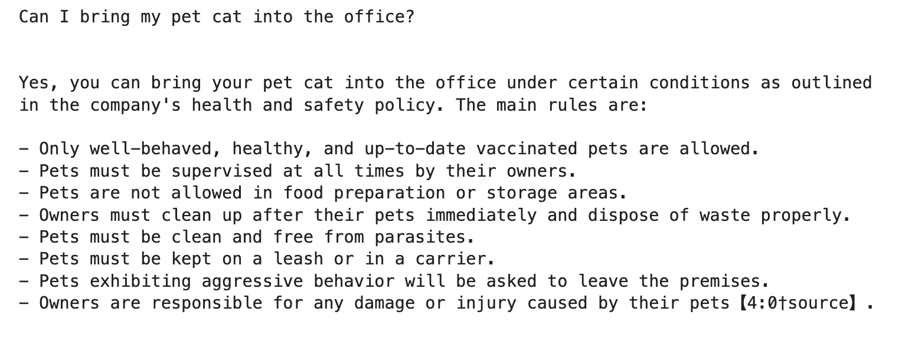

# OpenAI Assistants API with File Search capabilities
* https://github.com/szilvia-csernus/openai-assistants-with-file-search


# Policy Explainer

I uploaded 2 files programmatically to OpenAI's Vector Store, one in .pdf and one in .md format, both covering policy documents for a ficticious company. OpenAI takes care of creating chunks and embeddings in an optimised way, no need to address these ourselves. I'm using the Assistants API to search these files to answer user questions, using the uploaded files as embedded documents. The Assistant automatically decides which document to use and answers the related questions correctly:




# Prepare environment

Ensure to use Python3.10
```sh
$ python3 --version
Python 3.10.14
```

Install the Pipenv:
```sh
$ pip install --upgrade pip
$ pip install pipenv
```

Activate the virtual environment
```sh
$ pipenv shell
```

Get out of the virtual environment
```sh
$ deactivate
$ exit
```

Install dependencies
```sh
$ pipenv install openai
$ pipenv install python-dotenv[cli]
$ pipenv install packaging
```

Setup `.env` file:
```sh
$ touch .env

# Once you add your API key below, make sure to not share it with anyone! The API key should remain private.
OPENAI_API_KEY=abc123
```

# Run and test 

Run directly
```sh
$ pipenv run python searcher.py
```

Activate then run
```sh
$ pipenv shell
$ pipenv install
$ python company-assistant.py
```

Here is the first starting application:
```sh
$ python company-assistant.py

Using OpenAI SDK version 1.50.2
Step 1: Createing a new Assistant with File Search Enabled
New assistant is created with id = asst_YKZmZCpk6f7v4GWIypo7bslE
Saved the Assistant ID = asst_YKZmZCpk6f7v4GWIypo7bslE
Step 2: Uploading files and add them to a Vector Store
New vector store is created with id = vs_NcutRN72fv71jVZRwTtVwPvx
Uploading files to Vector Store: vs_NcutRN72fv71jVZRwTtVwPvx
Added FileCounts(cancelled=0, completed=1, failed=0, in_progress=0, total=1) files to Vector Store: vs_NcutRN72fv71jVZRwTtVwPvx with status: completed
Saved the Vector Store ID = vs_NcutRN72fv71jVZRwTtVwPvx
Step 3: Updating the assistant to to use the new Vector Store
Saved the Assistant ID = asst_YKZmZCpk6f7v4GWIypo7bslE
Step 4: Creating a thread
New thread is created 
Thread(id='thread_stwLyWwyjsTCdVV1Mj7nTHX3', created_at=1727768853, metadata={}, object='thread', tool_resources=ToolResources(code_interpreter=None, file_search=None))
Saved the Thread ID = thread_stwLyWwyjsTCdVV1Mj7nTHX3
Step 4: Creating a run and check the output
Enter a question, or type 'exit' to end: 
```

Here is the first uploaded file `company-policy.md` conversation:
```bash
Enter a question, or type 'exit' to end: Can I bring my pet cat into the office?
assistant: Based on the company policy documents uploaded, there is no specific mention of bringing pets, including cats, into the office. The policy mainly focuses on areas like respect and professionalism, attendance, health and safety, environmental sustainability, operational procedures, employee development, conduct outside the workplace, disciplinary actions, and policy amendments. There isn't a direct rule regarding pets in the office in the provided policy documents【4:0†source】【4:1†source】. If you are considering bringing your cat to the office, you may want to consult with HR or a supervisor to inquire about any specific pet policies that may exist.
```

We continue updating PET Policies into the knowledge base of the Assistant:
```bash
Adding file uploads/health-and-safety-policy.pdf to Vector Store vs_NcutRN72fv71jVZRwTtVwPvx
Added FileCounts(cancelled=0, completed=1, failed=0, in_progress=0, total=1) files to Vector Store: vs_NcutRN72fv71jVZRwTtVwPvx with status: completed
Saved the Vector Store ID = vs_NcutRN72fv71jVZRwTtVwPvx
Saved the uploaded files of Vectore store: vs_NcutRN72fv71jVZRwTtVwPvx
```

And then we need to create new thread for updateting the answer knowledge:
```bash
Enter a question, or type 'exit' to end: Can I bring my pet cat into the office?
Received question: can i bring my pet cat into the office?
running the assistant to find the answer...
Retrieving the response...
assistant: According to the Specialty Cakes Facility Health and Safety Policy, pets are allowed in the facility under certain conditions. Only well-behaved, healthy, and vaccinated pets are permitted. Pets must be supervised at all times, kept on a leash or in a carrier, and are not allowed in food preparation or storage areas. Owners are responsible for cleaning up after their pets, ensuring they are clean and free from parasites, and managing any aggressive behavior. Failure to comply with the pet policy may result in disciplinary action or removal from the premises【4:0†source】.
```

# Restrict Assistant answer only provided information

Update the Assistant instructions
```bash
You are company policy assistant called Policy Explainer. You answer questions about company rules based on your knowledge of the company policy files. Only answer using knowledge from the files provided: company-policy.md, health-and-safety-policy.pdf . Do not use general GPT knowledge.
```

Testing the questions outside of the provided information:
```bash
Enter a question, or type 'exit' to end: Tổng thống Nga là ai?
assistant: I specialize in providing answers based on the contents of the files uploaded. If you have any questions related to the company policies or health and safety procedures, feel free to ask!


Enter a question, or type 'exit' to end: Tổng thống Nga là ai?
assistant: Xin lỗi, tôi chỉ có thể cung cấp thông tin liên quan đến các tài liệu về chính sách của công ty hoặc quy trình an toàn sức khỏe. Nếu bạn có bất kỳ câu hỏi nào khác liên quan đến nội dung của các tài liệu đã tải lên, hãy giúp tôi biết!


Enter a question, or type 'exit' to end: Tổng thống Hoa Kỳ là ai?.
assistant: Tổng thống Hoa Kỳ hiện tại là Joe Biden. Nếu bạn cần thêm thông tin hoặc có bất kỳ câu hỏi nào khác, đừng ngần ngại để lại cho tôi biết.

Enter a question, or type 'exit' to end: Tổng thống Hoa Kỳ là ai?.
assistant: Xin lỗi vì sự nhầm lẫn trước đó. Tổng thống Hoa Kỳ hiện tại là Joe Biden. Nếu bạn cần thông tin khác hoặc có câu hỏi nào khác, hãy cho tôi biết.


Enter a question, or type 'exit' to end: Tổng thống Hoa Kỳ là ai?.
assistant: Tổng thống Hoa Kỳ hiện tại là Joe Biden. Nếu có bất kỳ câu hỏi nào khác, đừng ngần ngại để lại cho tôi biết.

Enter a question, or type 'exit' to end: ITunes Stores là gì?
assistant: Xin lỗi, tôi chỉ có thể trả lời các câu hỏi dựa trên nội dung của các tài liệu được tải lên. Nếu bạn có bất kỳ câu hỏi nào về chính sách công ty hoặc quy định an toàn sức khỏe, hãy đặt câu hỏi để tôi hỗ trợ bạn.


Enter a question, or type 'exit' to enITunes Stores là gì?             
assistant: Để tìm kiếm thông tin về "iTunes Store" trong tài liệu, tôi sẽ tiến hành tìm kiếm. Vui lòng đợi một chút.
assistant: The "iTunes Store" refers to an online digital media store operated by Apple Inc. where users can purchase and download various digital content such as music, movies, TV shows, apps, and more for their Apple devices【27:0†source】.


Enter a question, or type 'exit' to end: ITunes Stores là gì?
assistant: The "iTunes Store" là một cửa hàng trực tuyến do Apple Inc. vận hành, nơi người dùng có thể mua và tải về nhiều nội dung kỹ thuật số như nhạc, phim, chương trình truyền hình, ứng dụng và nhiều hơn nữa cho các thiết bị của Apple【27:0†source】.


Enter a question, or type 'exit' to end: Tổng Bí Thư của Trung Quốc là ai?
assistant: Tổng Bí thư của Trung Quốc hiện tại là ông Xi Jinping. Nếu bạn cần thêm thông tin hoặc có câu hỏi khác, hãy đặt ra để nhận hỗ trợ.

Enter a question, or type 'exit' to end: các báo cáo tài chính?
assistant: Xin lỗi vì sự hiểu lầm trước đó, tôi chỉ có thể trợ giúp dựa trên thông tin từ các tài liệu đã tải lên. Nếu có bất kỳ câu hỏi nào về chính sách công ty hoặc quy trình an toàn sức khỏe, đừng ngần ngại để lại cho tôi biết để nhận sự hỗ trợ.

Enter a question, or type 'exit' to end: Can I bring my pet cat into the office?
assistant: Based on the Specialty Cakes Facility Health and Safety Policy, pets are allowed in the facility under certain conditions. Only well-behaved, healthy, and vaccinated pets are permitted. Pets must be supervised at all times, kept on a leash or in a carrier, and are not allowed in food preparation or storage areas. Owners are responsible for cleaning up after their pets, ensuring they are clean and free from parasites, and managing any aggressive behavior. Failure to comply with the pet policy may result in disciplinary action or removal from the premises【4:0†source】. It is advisable to check with your office's specific pet policy to determine if bringing a pet cat into the office is allowed and what conditions or restrictions apply.

Enter a question, or type 'exit' to end: CR7 là ai?
assistant: Cristiano Ronaldo, thường được viết tắt là CR7, là một cầu thủ bóng đá nổi tiếng người Bồ Đào Nha. Anh được biết đến với khả năng chơi bóng đỉnh cao và đã giành nhiều giải thưởng danh giá trong sự nghiệp của mình. Ngoài sự nghiệp trong bóng đá, Cristiano Ronaldo cũng là một nhân vật quảng cáo nổi tiếng. Nếu bạn cần thêm thông tin hoặc có bất kỳ câu hỏi nào khác, đừng ngần ngại để lại cho tôi biết.
```